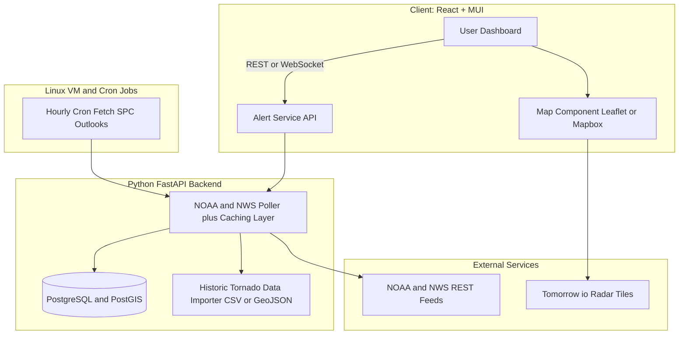

<!-- Header -->
<h1 align="center">🌪️ CycloneBB</h1>


<p align="center">
  <strong>Tornado-Alert & Storm-Path Dashboard</strong><br/>
  <em>Live severe-weather data • Web App • Built by <a href="https://github.com/ailynux">Ailyn Diaz</a></em>
</p>

<p align="center">
  
  
  
  
</p>

---

## Overview
**CycloneBB** is an open-source web dashboard that tracks **live tornado alerts, severe-weather warnings, and historic storm paths**.  
It’s going to be a playground to master **React + MUI**, **Python/FastAPI**, **Linux deployments**, and **geospatial visualization** — plus it’s just cool to watch storms in real-time.

---

<!-- NOTE: This is a stock placeholder image. Will probably use CycloneBB screenshot later but this one is silly enough for now. -->

<p align="center">

</p>

## Some Features planned
- ⛈ **Real-time NOAA / NWS alert feed** with risk-level badges  
- 🗺 **Interactive storm-path map** with dark-mode tiles  
- 📈 **Historic tornado outbreak replay** (EF-scale color-coded)  
- ⚡ **Instant alerts**: desktop notifications + optional SMS (Twilio)  
- 📊 **Dashboard widgets**: live radar snapshot, wind-speed gauge  
- 🐳 **Docker-ready backend** for quick Linux deployment  

---

## 🏗️ Architecture (WIP)



### 📂 Folder Structure (Plan WIP)
```
cyclonebb/
├─ frontend/            # React + MUI code
│  ├─ components/
│  ├─ pages/
│  ├─ hooks/
│  └─ styles/
│
├─ backend/             # Python FastAPI service
│  ├─ app/
│  │   ├─ main.py
│  │   ├─ routers/
│  │   ├─ models/
│  │   └─ services/
│  └─ tests/
│
├─ infra/               # Dockerfiles, deploy scripts, nginx config
├─ data/                # Sample historic tornado datasets
├─ docs/                # Diagrams, design notes
└─ README.md
```

---


---

## 🧑‍💻 Contributing
### PRs are welcome!  
#### Please open an issue first to discuss new features or bug fixes.


---

### 🌟 Acknowledgments

- NOAA / NWS for open severe-weather feeds

- Tomorrow.io for radar & forecast APIs

---

## ⚖️ License
Released under the **[MIT License](LICENSE)**  


© 2025 Ailyn Diaz — Built with ☕ & ⚡ for the storm-watching community.


------------------------------

#### NOTE: Planning to update the read me with the following i just need some more time 


# CycloneBB 🌪️

A modern React application for tracking tornado alerts and storm paths using real-time National Weather Service data.


## 🚀 Features

- **Real-time Alerts**: Live tornado warnings and watches from NWS
- **Interactive Dashboard**: Clean, modern interface with dark mode
- **Storm Tracking**: Visual storm path predictions (coming soon)
- **Responsive Design**: Works on desktop, tablet, and mobile
- **Auto-refresh**: Configurable data updates every 60 seconds
- **Risk Assessment**: Clear visual indicators for threat levels

## 🛠️ Tech Stack

- **Frontend**: React 18 + Vite
- **UI Framework**: Material-UI (MUI)
- **Routing**: React Router v6
- **Data Fetching**: TanStack Query (React Query)
- **Styling**: MUI theme system with custom dark palette
- **Icons**: Material Icons
- **Date Handling**: Day.js

## 📦 Installation

1. **Clone the repository**
   ```bash
   git clone <repository-url>
   cd cyclonebb
   ```

2. **Install dependencies**
   ```bash
   npm install
   ```

3. **Start development server**
   ```bash
   npm run dev
   ```

4. **Open in browser**
   ```
   http://localhost:3000
   ```

## 🎯 Available Scripts

- `npm run dev` - Start development server
- `npm run build` - Build for production
- `npm run preview` - Preview production build
- `npm run lint` - Run ESLint
- `npm run format` - Format code with Prettier

## 📱 Pages & Routes

- `/` - Landing page with hero section and features
- `/home` - Main dashboard with alerts and storm tracking
- `/about` - Project information and data sources

## 🎨 Design System

### Color Palette
- **Background**: `#0b0f18` (dark blue-gray)
- **Surface**: `#111827` (lighter blue-gray)
- **Primary**: `#00d8ff` (storm teal)
- **Secondary**: `#a78bfa` (neon purple)
- **Success**: `#22c55e` (safe green)
- **Warning**: `#f59e0b` (watch orange)
- **Error**: `#ef4444` (warning red)

### Typography
- **Font**: Inter (Google Fonts)
- **Weights**: 300, 400, 500, 600, 700
- **Scale**: Responsive typography with mobile-first approach

## 🔧 Configuration

### Environment Variables
Currently using mock data. To connect to real NWS API:

1. Create `.env` file:
   ```
   VITE_NWS_API_URL=https://api.weather.gov
   VITE_USER_AGENT=YourApp/1.0 (your-email@domain.com)
   ```

2. Update `src/app/lib/apiClient.js` to use real endpoints

### Mock Data
Mock data is located in `src/app/lib/mockData.js`. You can:
- Modify sample alerts for different scenarios
- Add new states/areas
- Simulate different risk levels

## 🏗️ Project Structure

```
src/
├── main.jsx                 # App entry point
├── App.jsx                  # Main app component with routing
├── app/
│   ├── routes/              # Page components
│   │   ├── Landing.jsx      # Landing page
│   │   ├── Home.jsx         # Dashboard
│   │   └── About.jsx        # About page
│   ├── layout/              # Layout components
│   │   └── AppLayout.jsx    # Main layout wrapper
│   ├── components/          # Reusable components
│   │   ├── Header.jsx       # Navigation header
│   │   ├── Footer.jsx       # Page footer
│   │   ├── AreaSelector.jsx # State selection dropdown
│   │   ├── RiskBadge.jsx    # Risk level indicator
│   │   ├── AlertsList.jsx   # Alerts container
│   │   ├── AlertCard.jsx    # Individual alert card
│   │   ├── StormMiniMap.jsx # Map placeholder
│   │   ├── LastUpdated.jsx  # Update status component
│   │   └── EmptyState.jsx   # Empty state component
│   ├── theme/               # MUI theme configuration
│   │   ├── theme.js         # Main theme
│   │   ├── palette.js       # Color definitions
│   │   └── typography.js    # Typography settings
│   └── lib/                 # Utilities and data
│       ├── apiClient.js     # API client (mock)
│       ├── mockData.js      # Sample data
│       ├── risk.js          # Risk calculation logic
│       └── constants.js     # App constants
```

## 🔄 Data Flow

1. **User selects area** → `AreaSelector` component
2. **React Query fetches data** → `apiClient.getAlerts(area)`
3. **Mock data returned** → `mockData.js` sample responses
4. **Risk calculated** → `risk.js` maps alerts to threat levels
5. **UI updates** → Components re-render with new data

## 🚨 Risk Levels

- **🟢 SAFE**: No active tornado threats
- **🟠 TORNADO WATCH**: Conditions favorable for tornado development
- **🔴 TORNADO WARNING**: Tornado spotted or indicated by radar

## 📊 API Integration

Currently using mock data. To integrate with real NWS API:

1. **Alerts Endpoint**: `https://api.weather.gov/alerts`
2. **Radar Data**: `https://api.weather.gov/radar`
3. **Forecast**: `https://api.weather.gov/gridpoints/{office}/{gridX},{gridY}/forecast`

## 🎯 Future Features

- [ ] Real NWS API integration
- [ ] Interactive storm tracking map
- [ ] Historical storm data
- [ ] Push notifications
- [ ] Custom alert preferences
- [ ] Storm path animations
- [ ] Mobile app (React Native)

## 🤝 Contributing

1. Fork the repository
2. Create a feature branch: `git checkout -b feature/amazing-feature`
3. Commit changes: `git commit -m 'Add amazing feature'`
4. Push to branch: `git push origin feature/amazing-feature`
5. Open a Pull Request

## 📄 License

This project is licensed under the MIT License - see the [LICENSE](LICENSE) file for details.

## ⚠️ Disclaimer

This application is for informational purposes only and should not be used as the sole source for weather emergency decisions. Always follow official guidance from local emergency management and the National Weather Service.

## 🙏 Acknowledgments

- [National Weather Service](https://www.weather.gov/) for providing weather data
- [Material-UI](https://mui.com/) for the component library
- [React](https://reactjs.org/) and [Vite](https://vitejs.dev/) for the development framework

---

**Stay safe and weather aware!** 🌪️