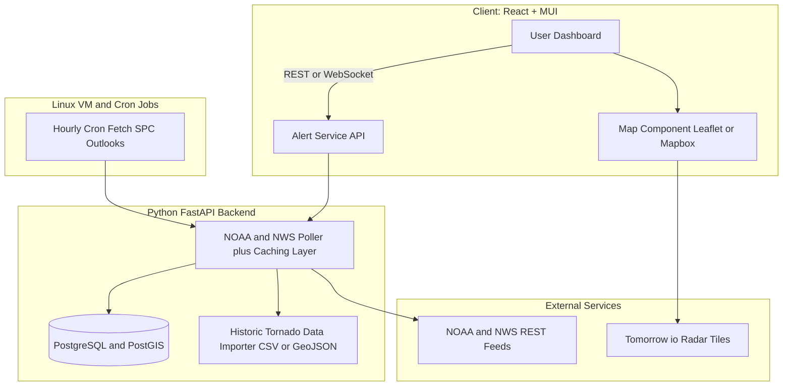

<!-- Header -->
<h1 align="center">🌪️ CycloneBB</h1>


<p align="center">
  <strong>Tornado-Alert & Storm-Path Dashboard</strong><br/>
  <em>Live severe-weather data • Web App • Built by <a href="https://github.com/ailynux">Ailyn Diaz</a></em>
</p>

<p align="center">
  
  
  
  
</p>

---

## Overview
**CycloneBB** is an open-source web dashboard that tracks **live tornado alerts, severe-weather warnings, and historic storm paths**.  
It’s going to be a playground to master **React + MUI**, **Python/FastAPI**, **Linux deployments**, and **geospatial visualization** — plus it’s just cool to watch storms in real-time.

---

<!-- NOTE: This is a stock placeholder image. Will probably use CycloneBB screenshot later but this one is silly enough for now. -->

<p align="center">

</p>

## Some Features planned
- ⛈ **Real-time NOAA / NWS alert feed** with risk-level badges  
- 🗺 **Interactive storm-path map** with dark-mode tiles  
- 📈 **Historic tornado outbreak replay** (EF-scale color-coded)  
- ⚡ **Instant alerts**: desktop notifications + optional SMS (Twilio)  
- 📊 **Dashboard widgets**: live radar snapshot, wind-speed gauge  
- 🐳 **Docker-ready backend** for quick Linux deployment  

---

## 🏗️ Architecture (WIP)



### 📂 Folder Structure (Plan WIP)
```
cyclonebb/
├─ frontend/            # React + MUI code
│  ├─ components/
│  ├─ pages/
│  ├─ hooks/
│  └─ styles/
│
├─ backend/             # Python FastAPI service
│  ├─ app/
│  │   ├─ main.py
│  │   ├─ routers/
│  │   ├─ models/
│  │   └─ services/
│  └─ tests/
│
├─ infra/               # Dockerfiles, deploy scripts, nginx config
├─ data/                # Sample historic tornado datasets
├─ docs/                # Diagrams, design notes
└─ README.md
```

---


---

## 🧑‍💻 Contributing
### PRs are welcome!  
#### Please open an issue first to discuss new features or bug fixes.


---

### 🌟 Acknowledgments

- NOAA / NWS for open severe-weather feeds

- Tomorrow.io for radar & forecast APIs

---

## ⚖️ License
Released under the **[MIT License](LICENSE)**  


© 2025 Ailyn Diaz — Built with ☕ & ⚡ for the storm-watching community.

